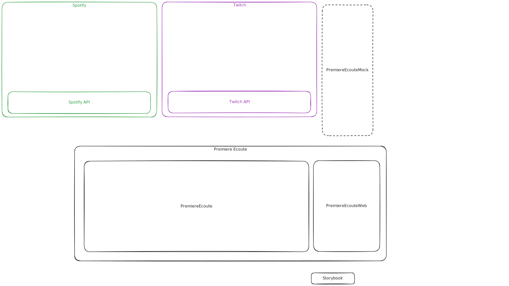

# 🏗️ Architecture Overview

Premiere Ecoute is a social music listening platform built on Phoenix/Elixir that enables Twitch streamers to create interactive album listening experiences with their communities. The system orchestrates complex real-time workflows where streamers select albums, control Spotify playback, and engage their Twitch audience through voting and chat integration, all while maintaining synchronized state across multiple concurrent sessions.

## System Overview

The platform serves two primary user flows: streamers who create and manage listening sessions, and viewers who participate through voting and real-time interaction. When a streamer starts a session, they authenticate with both Spotify and Twitch, select an album, and begin playback through their Spotify Premium account. Viewers join through the web interface and can vote on tracks via chat commands or polls, with their feedback immediately aggregated and displayed in real-time overlays for the stream.

The architecture emphasizes resilience and real-time responsiveness, handling scenarios where external APIs experience latency or failures while maintaining user experience continuity. The system supports multiple concurrent sessions, each with independent state management, voting aggregation, and external API coordination.

## Architecture Diagram



## Core Architectural Principles

**Event-Driven Command Processing**: The system implements a sophisticated Command/Event Bus pattern where all business operations flow through centralized command processing. When a user starts a listening session, the `StartListeningSession` command is validated, executed, and automatically generates events like `SessionStarted` that trigger side effects such as Twitch poll creation and real-time UI updates. This pattern ensures data consistency, enables comprehensive audit logging, and provides reliable integration points for complex workflows.

**Domain-Driven Architecture**: The codebase is organized around clear business domains—Sessions, Accounts, and APIs—each encapsulating their data models, business logic, and integration concerns. The Sessions domain handles the core listening session workflow, while the Accounts domain manages user authentication and OAuth token lifecycle. The API domain provides clean interfaces to external services with behavior contracts that enable testing and development mocking.

**Real-Time State Synchronization**: Phoenix LiveView and PubSub work together to maintain synchronized state across all connected clients. When a vote is cast or a track changes, events propagate through the system triggering immediate UI updates, overlay refreshes, and external API calls. This creates a responsive user experience where all participants see consistent state regardless of their entry point or device.

## System Components and Data Flow

### Command and Event Bus Architecture

The Command Bus (`lib/premiere_ecoute/core/command_bus.ex`) serves as the system's central nervous system, processing all business operations through a consistent pipeline: validation → execution → event dispatch. For example, when a streamer advances to the next track, the `NextTrackCommand` validates the session state, updates the current track reference, triggers Spotify API calls for playback control, and emits `NextTrackStarted` events that update the UI and notify viewers.

The Event Bus complements this by providing decoupled event handling where domain events trigger cross-cutting concerns like cache updates, telemetry collection, and external notifications. This separation enables the core business logic to remain focused while supporting complex integration requirements.

### Session Management and Scoring

The Sessions domain (`lib/premiere_ecoute/sessions/`) orchestrates the complete listening session lifecycle from preparation through completion. Sessions maintain state through explicit transitions—preparing → active → stopped—with each transition triggering appropriate external API calls and user notifications. The scoring system aggregates real-time votes from multiple sources (chat commands, polls, direct UI interaction) and provides immediate feedback through live reports that update as votes are received.

Session state is cached for high-performance access during real-time operations, with the cache serving as the primary data source for Twitch chat integration and overlay displays. This design enables sub-second response times for vote processing while maintaining data consistency through eventual persistence to the database.

### External API Integration Strategy

The API integration layer (`lib/premiere_ecoute/apis/`) implements a dual-mode architecture supporting both production integrations and development mocking. In production, OAuth2 flows manage token lifecycle automatically, with background jobs refreshing tokens before expiration and handling API rate limiting through intelligent backoff strategies.

**Spotify Integration**: Supports both application-level access for album metadata and user-level access for playback control. The player integration manages complex device selection, queue manipulation, and playback state synchronization while gracefully handling common edge cases like device unavailability or subscription limitations.

**Twitch Integration**: Enables bidirectional communication through EventSub webhooks for real-time chat message processing and poll result aggregation. The integration maintains persistent WebSocket connections for immediate event delivery while providing fallback mechanisms for connection failures.

**Development Environment**: Mock implementations (`lib/premiere_ecoute_mock/`) simulate external API behavior without requiring live credentials, enabling complete feature development and automated testing. The mock layer maintains compatibility with production API contracts while providing predictable responses for testing scenarios.

## Real-Time Communication Architecture

The real-time layer combines Phoenix LiveView, WebSocket channels, and PubSub to create seamless bidirectional communication. LiveView handles the primary user interface with automatic state synchronization, while custom WebSocket channels manage specialized communication like OBS overlay updates and administrative interfaces.

Phoenix PubSub serves as the message backbone, routing events between processes and enabling horizontal scaling. When a vote is cast, it propagates through PubSub to update all connected LiveView processes, trigger cache updates, and notify external systems. This architecture supports hundreds of concurrent users per session with minimal latency.

The overlay system provides a specialized real-time interface designed for OBS integration, displaying voting results, session progress, and track information with customizable layouts. This interface operates independently from the main application UI, ensuring stream stability even during high user activity.

## Data Persistence and State Management

The PostgreSQL database schema is optimized for the platform's read-heavy workload with strategic indexes supporting real-time queries. The core schema centers on users, albums, tracks, and listening sessions, with a normalized structure that maintains referential integrity while supporting efficient aggregation queries for reporting and analytics.

**Multi-Layer Caching**: ETS-based caching provides in-memory storage for frequently accessed data including API tokens, active session state, and user preferences. Cache keys are organized by domain with configurable TTL policies that balance performance with data freshness requirements. This caching strategy reduces database load by over 80% during peak usage while maintaining data consistency.

**Event Sourcing Patterns**: Critical business events are persisted as immutable event streams, enabling comprehensive audit trails and supporting eventual consistency patterns. This approach provides reliable replay capabilities for debugging and analytics while ensuring that complex state transitions are captured accurately.

## Error Handling and Resilience

The system implements comprehensive error handling strategies designed to maintain user experience during external service disruptions. Circuit breaker patterns protect against cascading failures when external APIs experience issues, automatically switching to degraded mode operation where core functionality continues while non-essential features are temporarily disabled.

Retry mechanisms with exponential backoff handle transient failures, while dead letter queues capture permanently failed operations for manual review. The supervision tree architecture ensures automatic process recovery, and comprehensive logging provides detailed context for debugging production issues.

Background job processing through Oban provides reliable execution of deferred tasks like token refresh, data synchronization, and cleanup operations. Jobs are automatically retried with configurable policies and include monitoring dashboards for operational visibility.

## Development and Deployment Architecture

The application supports environment-specific configuration enabling seamless transitions between development, staging, and production environments. Docker containerization provides consistent runtime environments, while database migrations ensure schema consistency across deployments.

**Development Experience**: The mock API layer enables complete local development without external service dependencies. Phoenix LiveReload provides instant feedback during development, while comprehensive test suites ensure reliability across all architectural layers.

**Production Deployment**: The system is optimized for cloud deployment with horizontal scaling capabilities, health check endpoints, and graceful shutdown handling. Database connection pooling and application-level caching support high concurrency, while telemetry integration provides comprehensive operational visibility.

## Observability and Operations

Comprehensive telemetry collection through Phoenix Telemetry and PromEx provides detailed insights into system performance, external API health, and business metrics. Custom telemetry handlers track domain-specific events like session creation rates, vote submission patterns, and API integration performance.

The monitoring stack includes application metrics, infrastructure monitoring, and business intelligence dashboards that enable proactive issue identification and capacity planning. Structured logging provides detailed context for debugging while maintaining performance through asynchronous log processing.

## Project Structure and Organization

```
lib/
├── premiere_ecoute/           # Core business domain logic
│   ├── accounts/              # User management, OAuth flows, permissions
│   │   ├── services/          # Domain services (registration, compliance, follows)
│   │   └── user/              # User entity and related models
│   ├── apis/                  # External service integrations (Spotify/Twitch)
│   │   ├── spotify_api/       # Spotify Web API client modules
│   │   ├── twitch_api/        # Twitch Helix API client modules
│   │   └── workers/           # Background job processing
│   ├── core/                  # Command Bus, Event Bus, shared utilities
│   │   ├── command_bus/       # Command processing infrastructure
│   │   └── event_bus/         # Event dispatch infrastructure
│   ├── sessions/              # Listening sessions, scoring, discography
│   │   ├── discography/       # Album and track management
│   │   │   ├── album/         # Album entity and track relationships
│   │   │   └── playlist/      # Playlist management
│   │   ├── listening_session/ # Session lifecycle management
│   │   └── scores/            # Voting and scoring system
│   │       └── vote/          # Vote processing and aggregation
│   ├── telemetry/             # Observability, metrics, monitoring
│   │   └── apis/              # API-specific telemetry handlers
│   └── events/                # Cross-domain event definitions
├── premiere_ecoute_web/       # Presentation and communication layer
│   ├── channels/              # WebSocket communication, real-time updates
│   ├── controllers/           # HTTP request handling, API endpoints
│   │   ├── accounts/          # Authentication and user management
│   │   ├── admin/             # Administrative interfaces
│   │   ├── errors/            # Error handling and display
│   │   ├── static/            # Static content serving
│   │   │   ├── changelog/     # Release notes and updates
│   │   │   │   └── html/      # Changelog templates
│   │   │   └── legal/         # Legal documents and policies
│   │   │       └── html/      # Legal document templates
│   │   └── webhooks/          # External service webhooks
│   ├── live/                  # LiveView interfaces, real-time UI
│   │   ├── accounts/          # User account management interfaces
│   │   ├── admin/             # Administrative interfaces
│   │   └── sessions/          # Session management interfaces
│   │       ├── components/    # Session-specific UI components
│   │       └── discography/   # Album and playlist selection
│   ├── components/            # Reusable UI components, design system
│   │   └── layouts/           # Application layout templates
│   ├── hooks/                 # LiveView lifecycle hooks
│   ├── plugs/                 # Request processing, authentication, middleware
│   └── static/                # Static content management
├── premiere_ecoute_mock/      # Development API mocks and test fixtures
│   └── twitch_api/            # Twitch API simulation
└── mix/                       # Mix tasks and utilities
    └── tasks/                 # Custom Mix tasks
        ├── gettext/           # Internationalization tasks
        └── spotify/           # Spotify development utilities
```

This detailed structure reveals the sophisticated organization within each domain, showing how complex functionality is broken down into focused, maintainable modules. The Sessions domain demonstrates event sourcing patterns with separate command and event handling, while the APIs domain shows clear separation between different external services and their concerns. The Web layer illustrates the comprehensive real-time interface architecture with specialized components for different user roles and use cases. This organization enables developers to quickly locate relevant code while maintaining clear boundaries between different aspects of the system.