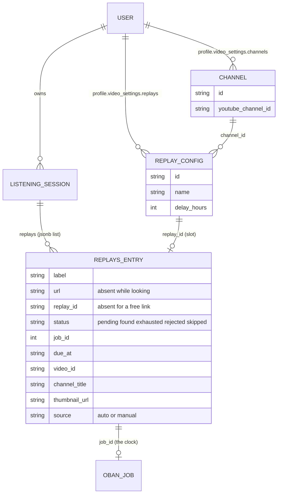
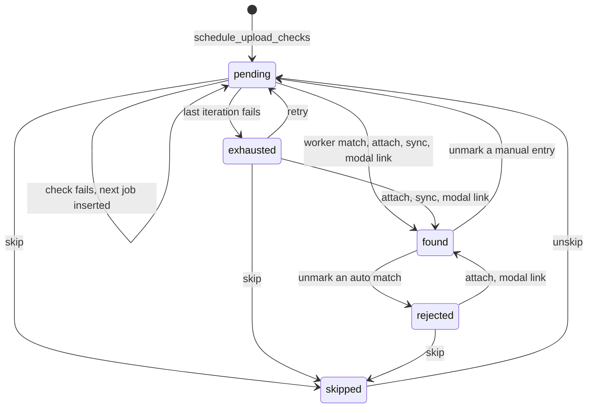
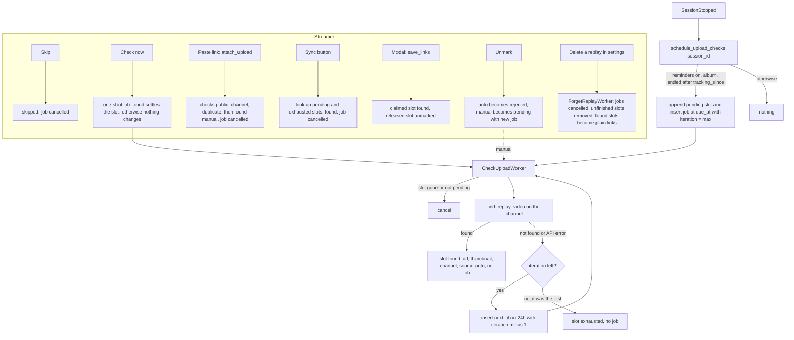

# VOD upload reminders

Status: built, on the My Sessions page. Goal: never forget to upload one of the VOD replays (raw, edited, ...) of a listening session to YouTube.

A streamer declares which replays they upload, and on which YouTube channel. When a session stops, one background job per replay is scheduled for the moment the upload is due. The job looks for the video on the channel. If it finds it, it fills in the replay link on the session. If not, it records the failure and reschedules itself, until it succeeds, runs out of iterations, or the streamer skips the replay. The My Sessions page shows where every replay stands, card by card, with the actions that apply.

No new table, no Google OAuth.

## Overview

### Data

One jsonb list holds everything. The Oban job is only the clock.



### Slot status



### Workflow



Every write to `replays` (worker, actions, sync, modal) first takes `FOR UPDATE` on the session row, then rewrites the list.

## Decisions

- **Replays are free-form per streamer** (`raw`, `edited`, `short`, ...), each with its own due delay (default 24h).
- **A streamer can have several YouTube channels.** Every replay targets exactly one; the target is **strict**.
- **Uploads are assumed public.** A video the API cannot see (scheduled, unlisted, private) is not found, so the replay stays pending and the job keeps looking.
- **One job per (session, replay)**, scheduled at session end plus the replay's delay. Each run that does not find the video inserts the job of the next check.
- **The My Sessions card is the only place** that reports missing uploads and offers the actions. There is no standalone page, no notification, and nothing in the sidebar, the dashboard or the session page. The page updates at once, through PubSub, when a check changes a slot.
- **A job ends** on success, on max iterations, or when the streamer marks the replay skipped (or marks it uploaded by hand).
- **VOD expiry is ignored.** Twitch keeps about 100h of VODs in total, judged large enough. Sessions without a VOD are treated like any other.
- **Restarted sessions are not supported.** A stopped session is never restarted in practice.
- **Only sessions ended after the streamer enabled tracking are counted**, so existing history is not scheduled.
- **The slots of a session are the replays configured when it stopped.** A replay added later gets no slot on existing sessions, and nothing backfills them.

## What exists today

| Piece | State |
|---|---|
| `ListeningSession.replays` | `{:array, :map}` (jsonb), entries `%{"label", "url"}`, edited by hand in `SessionLive`, **shown to viewers**. Now also holds the tracking slots (below). |
| `Events.SessionStopped` + `EventHandler.dispatch/1` | Where jobs get scheduled. |
| `User.Profile.video_settings` | embed (`show_name`, `title_template`). `profile` is a jsonb column on `users`. |
| `TitleTemplate`, `TrackMarker.format_youtube_chapters/2`, `YoutubeMetadata` component | Prepare the title, description and chapters for an upload. |
| `PremiereEcouteCore.Worker`, Oban 2.24 | Worker idiom; queues in `config/config.exs`. |
| `YoutubeApi.get_video/1`, `get_channel_videos/2` | API key, 1 quota unit per call (per page for the channel). Both return `channel_id`, `channel_title`, `title`, `privacy` and `thumbnail_url`. |

Constraint: Twitch's API returns no VOD file, so uploading cannot be automated. This feature only tracks, detects and reminds.

## Data model

Everything fits in existing jsonb columns. **No migration.**

### `Profile.VideoSettings` (extended)

```
video_settings
├── show_name, title_template            (existing)
├── reminders_enabled: boolean           explicit on/off switch, default false
├── tracking_since: date | nil           set when the switch goes on, cleared when it goes off
├── channels: [Channel]
└── replays: [Replay]
```

`Channel` (embed, `primary_key: {:id, :binary_id, autogenerate: true}`)

| Field | Type | Rules |
|---|---|---|
| `id` | binary_id | Stable reference used by replays. |
| `label` | string | Required, 1-40 chars, unique within the list. Display only (`@MainChannel`). |
| `youtube_channel_id` | string | Required, matches `~r/^UC[\w-]{22}$/`, unique. |

`Replay` (embed, same primary key)

| Field | Type | Rules |
|---|---|---|
| `id` | binary_id | Stable reference stored on state and on `ListeningSession.replays` entries. Renaming a replay keeps its history. |
| `name` | string | Required, 1-40 chars, unique case-insensitively. |
| `channel_id` | binary_id | Required. Must match a `Channel.id` in the same settings. |
| `delay_hours` | integer | Default 24, between 1 and 720. |

Deleting a channel with replays pointing at it is rejected by the changeset (reassign first). Deleting a replay is handled by `Accounts.User.edit_user_profile/2`: for every replay id that disappears from the settings, it enqueues a `ForgetReplayWorker` (`Sessions.forget_replay/2`). The worker runs `ReplayVideo.forget_replay/2` over the user's sessions that have entries for that replay: the live job is cancelled, a slot still being looked for is removed, and a found slot becomes a plain link again (it keeps its video and loses its `replay_id` and tracking fields).

`tracking_since` is set to today when `reminders_enabled` goes from false to true, and cleared when it goes back to false. Replays can be configured while the feature is off; nothing is scheduled until it is on.

### Job schedule config

```elixir
config :premiere_ecoute, PremiereEcoute.Sessions.Services.ReplayVideo,
  interval_hours: 24,
  max_iterations: 7
```

First check at `due_at`, then every 24h. 7 iterations cover `due_at` plus 6 days, then the job gives up. `max_iterations` is the `iteration` the first job starts with (`ReplayVideo.max_iterations/0`). Each failed check inserts the next job with one iteration less, and the slot is `exhausted` when the last one fails. The counter lives in the job args, not in the slot, so changing the config does not affect jobs already running. `interval_hours` is read when the next job is inserted. Per-streamer overrides are out of scope.

### `ListeningSession.replays`: one entry per replay

There is no separate state. Each configured replay of the session is one entry of `replays`, the list the page already shows. An entry carries the tracking state while the video is unknown, and the video once it is found. The Oban job is only the clock.

```json
{
  "replay_id": "7c1e...",
  "label": "edited",
  "status": "pending",
  "job_id": 48213,
  "due_at": "2026-10-04T23:40:00Z",
  "last_checked_at": "2026-10-06T23:40:02Z"
}
```

When the video is found, the same entry gains the video fields, and `status` becomes `found`:

```json
{
  "replay_id": "7c1e...",
  "label": "edited",
  "status": "found",
  "url": "https://www.youtube.com/watch?v=abc123",
  "video_id": "abc123",
  "title": "PREMIÈRE ÉCOUTE : \"Bass Persuades\" by Artist",
  "youtube_channel_id": "UCxxxxxxxxxxxxxxxxxxxxxx",
  "channel_title": "Lanfeust Plays",
  "thumbnail_url": "https://i.ytimg.com/vi/abc123/hqdefault.jpg",
  "uploaded_at": "2026-10-05T11:40:02Z",
  "source": "auto"
}
```

Three kinds of entries live in the list:

| Kind | Has | Shown on the page |
|---|---|---|
| Free link | `label`, `url`, no `replay_id` | Yes (a Twitch VOD typed by hand, for example). |
| Slot being looked for | `replay_id`, `status`, no `url` | No. Only entries with a `url` are displayed, to viewers and in the modal. |
| Found slot | `replay_id`, `url`, video fields | Yes. |

A slot with a `replay_id` and a `url` but no `status` (linked by hand through the modal, or stored with no tracking) counts as `found`. `ReplayVideo.status/1` gives the status of any entry.

| Field | Meaning |
|---|---|
| `replay_id` | Id of the configured replay. Unique per session: `ReplayVideo.slot/2` finds the entry. |
| `job_id` | Id of the live `CheckUploadWorker` job. Cancel and retry go through it by primary key, no search in `oban_jobs`. It changes at every check, since each check inserts the next job. `null` once the job has ended. |
| `status` | `pending` (job alive), `found`, `exhausted` (the last iteration failed), `rejected` (the streamer unmarked a wrong auto-match), `skipped`. |
| `due_at` | Session `ended_at` + the replay's `delay_hours` at scheduling time. Snapshot: later delay changes do not re-date it. |
| `last_checked_at` | When the last check ran, or `null`. |
| `video_id` | The dedupe key: the same video cannot satisfy two replays of the same session. |
| `title` | The video's title, shown on the My Sessions card and as the main text of the replay on the session page (the replay name and the channel go under it). Absent on entries stored before it existed: the name of the replay is shown instead. |
| `channel_title`, `thumbnail_url` | What the session page shows next to the link. Both can be `null`; the page then falls back to the host of the link, or no image. |
| `uploaded_at` | When it was recorded (not YouTube's publish date). |
| `source` | `"manual"` or `"auto"`. An `"auto"` match can be unmarked, a wrong one becoming `rejected`. |
| `label` | The replay name, shown to viewers by the existing replays list. |

Status transitions:

| From | To | Trigger |
|---|---|---|
| `pending` | `found` | The job finds the video (`source: "auto"`), or the streamer marks it by hand, or syncs. |
| `pending` | `exhausted` | The last iteration fails. |
| `pending` | `skipped` | Streamer skips. |
| `exhausted` | `pending` | Retry (a new job starts again from the max iteration). |
| `exhausted` | `found` / `skipped` | Mark by hand or sync / skip. |
| `found` | `rejected` | Streamer unmarks an `"auto"` match: the video fields are removed and detection is **not** restarted. |
| `found` | `pending` | Streamer unmarks a `"manual"` entry (typo in the URL): video fields removed, job revived. |
| `rejected` | `found` / `skipped` | Mark by hand / skip. No retry and no sync: it would likely re-match the same wrong video. |
| `skipped` | `pending` | Unskip (a new job starts again from the max iteration). |

`rejected` and `exhausted` both mean "automatic detection is over, the streamer must act". No extra field is needed to remember the wrong video: no job runs in `rejected`, so nothing can re-match it.

**The replays modal** goes through `ReplayVideo.manual_entry/2` for each row, then `ReplayVideo.save_links/2`. It lists the entries with a `url` only, and slots still being looked for are kept as they are. A changed YouTube link is looked up with `YoutubeApi.get_video/1` (1 quota unit) and stored with `source: "manual"`, `video_id`, `channel_title`, `thumbnail_url` and the rest. Any other link, or a failed lookup, stays a plain `label` and `url` entry. An unchanged link keeps everything it had, unless the entry is plain (no `video_id`): saving it again retries the lookup. Each row has a select to link the link to a configured replay (`replay_id`):
- a link carrying the `replay_id` of a tracked slot settles it as `found` and cancels its job;
- a link that no longer carries a tracked `replay_id` (deleted, or moved to another replay) is unmarked like the Unmark action: `rejected` for an auto match, back to `pending` otherwise;
- the write is under `FOR UPDATE`, like the worker and the actions.

## Scheduling

On `SessionStopped`, `EventHandler.dispatch/1` calls `Sessions.schedule_upload_checks(session_id)`:

1. Load the streamer's `video_settings`. No replays, `reminders_enabled` false, or a session that ended before `tracking_since`: stop.
2. For each replay without an entry in `replays`, in one transaction: insert one `CheckUploadWorker` job with `scheduled_at: due_at`, then append the `pending` slot (`replay_id`, `label`, `job_id`, `due_at`, no `url`). The job args carry `iteration: max_iterations`. The slots of a session are the replays configured when it stopped: a replay added later gets no slot on existing sessions, and nothing backfills them.

## `CheckUploadWorker`

```elixir
use PremiereEcouteCore.Worker,
  queue: :uploads,
  max_attempts: 3,
  unique: [period: :infinity, keys: [:session_id, :replay_id], states: [:available, :scheduled, :retryable]]
```

`uploads: 1` is added to the Oban queues. Args: `%{"session_id" => id, "replay_id" => id}`. `unique` guarantees a single waiting job per (session, replay), including against double scheduling. `:executing` is left out of `states` on purpose: the running job inserts the next one, which would otherwise conflict with itself.

`max_attempts: 3` is only for crashes in the worker itself. The remaining iterations live in the job args, and the next check is a new job inserted with `scheduled_at`, not `{:snooze, seconds}`. Oban's docs describe snooze with examples of seconds to an hour, and mark the job `scheduled` again; for a delay of hours this worker inserts the next job instead, like Oban's reliable-scheduling recipe.

`perform/1`:

1. Load the session with its user and the replay from the settings. Either gone, or no slot: `{:cancel, :gone}`.
2. Read the slot. Anything other than `pending` (the streamer skipped or marked it while the job was waiting): `{:cancel, :not_pending}`. This makes a cancel that arrived too late harmless.
3. Look for the video (below), outside any transaction.
4. In one locked transaction, re-read the entry (a skip that arrived meanwhile wins, `{:cancel, :not_pending}`) and apply the result:
   - **Found:** `ReplayVideo.found_entry/5` writes the video into the slot (the autofilled link, with its title and thumbnail), and the status becomes `found`, `job_id: nil`.
   - **Not found, or an API error:** one failed iteration: `last_checked_at = now`. While the job's `iteration` is above 1, the next `CheckUploadWorker` job is inserted with `iteration - 1` and `scheduled_at: now + interval_hours` in the same transaction, and its id replaces `job_id`. On the last iteration, `status: "exhausted"`, `job_id: nil`, and no job is inserted.

When a run changes the slot, it broadcasts `{:replay_updated, session_id, replay_id}` on `uploads:<user_id>`, and the My Sessions page refreshes that card. The job never dispatches a notification.

Each outcome is logged by the worker: `info` when the video is found, `info` for a video not found yet (with the checks left), `error` when the check itself failed (an API error, with its reason), and `warning` when it gives up on the last one.

An API error counts as an iteration like any failure, and is not told apart from "not found". One consequence: a long YouTube outage burns iterations. At 24h spacing, an outage covering one check costs one of the 7 iterations; a multi-day outage can exhaust the job, and the streamer can then use **Retry**.

### Finding the video

`Sessions.Services.ReplayVideo` (`lib/premiere_ecoute/sessions/services/replay_video.ex`):

- `find_replay_video(session, replay)` returns `{:ok, Video}` or `{:error, reason}`: `:not_found` (no match, or the channel is no longer in the settings), `:session_not_valid`, or the API error. The worker counts both as a failed iteration. It resolves the replay's channel in the streamer's settings, calls `YoutubeApi.get_channel_videos(youtube_channel_id, since: session.ended_at)`, then keeps the public videos whose title contains the artist and the album name.

`get_channel_videos/2` reads the channel's uploads playlist (the channel id with `UC` replaced by `UU`), newest first, up to 3 pages of 50, and stops paging once a video predates `since`. 1 quota unit per page, API key, public videos only. Each `Video` carries `channel_id`, `description`, `privacy` and `published_at` (`contentDetails.videoPublishedAt`, not the date it joined the playlist). At most 3 units per iteration, one iteration per replay per 24h.

### Matching rules

Version 1 is deliberately simple: the title only. A video `v` matches session `s` when all hold:

1. `v` comes from the replay's channel and was published since the session ended (both by construction of the fetch: `get_channel_videos(channel, since: s.ended_at)`).
2. `v` is public.
3. The title of `v` contains the session's artist and album name, ignoring case, accents and punctuation.

The first matching video is returned. There is one replay per channel, so a second video with the same artist and album in its title is not expected. When none matches, `:not_found`, and the streamer can mark it by hand.

Only `:album` sessions are supported: `find_replay_video/2` only has a clause for them, so the scheduler must not create checks for other sources.

Possible later signals, not built: the session share URL in the description, the rendered title template, and the replay name to tell siblings apart.

### Cancellation

| Trigger | Effect |
|---|---|
| Found | State `found`, no next job. |
| Last iteration fails | State `exhausted`, no next job. |
| Streamer skips | State `skipped`, job cancelled with `Oban.cancel_job(job_id)`. |
| Streamer marks uploaded by hand | State `found`, job cancelled the same way. |
| Replay deleted from the settings | `ForgetReplayWorker` cancels the replay's jobs (see Data model). |
| Session deleted | Its pending jobs are left to cancel themselves: a late job finds no session at step 1 (`{:cancel, :gone}`). |

The actions are `Sessions.skip_upload/2`, `unskip_upload/2`, `retry_upload/2`, `check_upload_now/2`, `unmark_upload/2` (all `session_id, replay_id`) and `attach_upload/3` (`session_id, replay_id, url`). Each runs under `FOR UPDATE`, returns `{:ok, session}` or `{:error, reason}`, and refuses a status it does not apply to with `:invalid_transition`. **Check now** (`check_upload_now/2`) returns `{:ok, job}` of a one-shot `CheckUploadNowWorker`, described below.

Reviving: **Retry** on an `exhausted` row, **unskip**, or **unmark** on a `"manual"` row sets the entry to `pending` and inserts a new job for it (`iteration: max_iterations`, available at once), replacing `job_id`. 

**Check now** is a separate job, not a push on the scheduled one. `CheckUploadNowWorker` has no iteration (`max_attempts: 1`, unique per session and replay while one is waiting or running) and calls `ReplayVideo.check_upload_once/2`:
- found: the slot becomes `found` and the scheduled job is cancelled;
- not found or API error: only `last_checked_at` changes. No iteration is counted and no job is inserted, so the scheduled checks go on as planned;
- either way the worker broadcasts `{:replay_checked, session_id, replay_id, :found | :not_found | :error | :settled}` on `uploads:<user_id>`. The My Sessions page subscribes, disables the button ("Checking...") while it waits, and refreshes the card when the answer comes, within a few seconds. After 20 seconds without an answer it gives the button back and shows an error.

### Safety

- **No lost update:** every writer of `replays` (the worker, sync, mark, skip, unmark, the replays modal) re-reads the session with `FOR UPDATE` in a transaction before writing, so two concurrent writers cannot overwrite each other.
- **Idempotent:** `attach_upload/3` refuses a `video_id` already in `replays` (`:duplicate`), and the replays modal refuses two links for the same replay (`:duplicate_replay`).
- **Audit:** Oban's `Pruner` (`config/config.exs`) keeps finished jobs (completed, cancelled, discarded) for 7 days, so the checks of the last week stay in `oban.oban_jobs` and in Oban Web (`/oban`, admin only): worker, `args` (session, replay, iteration), `scheduled_at`, `attempted_at`, state and `errors`. The setting is global to every worker.
- **Clock vs state:** the page reads state, never Oban. State and job insertion happen in the same transaction when scheduling. Oban's Pruner only deletes finished jobs, and a `pending` job is never finished.

## Query performance

The tracking state sits in jsonb, but no query searches *inside* it. The My Sessions page reads its sessions page by page through `ListeningSession.page_for_user/2` (the existing `user_id` index), and the slots come with the row. Nothing else reads them:
- the worker reads and writes one session row by primary key, `FOR UPDATE`, a handful of times per streamer per day;
- an action cancels a job by `job_id` (primary key), with no search in `oban_jobs`;
- `ReplayVideo.forget_replay/2` is the only query on the content of `replays`: the user's sessions filtered by `unnest(replays)`. It runs once per replay deleted from the settings.

No GIN index on `replays`: it would make every update of that column a non-HOT update, on a table the session workers already write to. `replays` is small, so rewriting the whole list under `FOR UPDATE` costs the same as a `jsonb_set`; the lock, not the jsonb, prevents lost updates.

## My Sessions card

`/sessions` (`SessionsLive`) keeps its card: cover, title, artist, source, status and date badges, delete, and a click that opens the dashboard. The replay slots of the session sit under it, outside the clickable area (`ReplaySlots` component, `lib/premiere_ecoute_web/live/sessions/components/replay_slots.ex`). A session without slots shows nothing more.

```
┌────────────────────────────────────────────────────────────────┐
│ [cover] Bass Persuades        Album  Stopped  ⚠ 2 replays      │
│         Artist                       12 Sep 2026   missing  🗑 >│
├────────────────────────────────────────────────────────────────┤
│ ✔ Found    raw     PREMIÈRE ÉCOUTE : "Bass Persuades"  Lanfeust Plays  [Unmark]│
│ ⏱ Missing  edited                      [Check now] [Link] [Skip]│
│ ⚠ Missing  short   not found after all checks  [Retry] [Link] [Skip]│
└────────────────────────────────────────────────────────────────┘
```

One row per slot (`ReplayVideo.slots/1`: one per `replay_id`, the first entry wins):

| Status | Badge | Actions |
|---|---|---|
| `found` | green "Found", the video title (a link) and its channel | Unmark |
| `pending` | blue "Missing" | Check now, Link, Skip |
| `exhausted` | amber "Missing", "not found after all checks" | Retry, Link, Skip |
| `rejected` | amber "Missing", "match rejected" | Link, Skip |
| `skipped` | grey "Skipped" | Unskip |

The header badge counts the missing slots (`pending`, `exhausted`, `rejected`): amber, and the card border too, when at least one is `exhausted` or `rejected` (it needs the streamer), blue when they are all still being looked for.

Behaviour:
- **Link** opens an inline form on that row (one at a time). It runs `Sessions.attach_upload/3`; the errors show under the field: not a YouTube link, video not found or not public yet, "this video is on X, not on the channel of this replay", already linked to this session.
- **Check now** inserts a `CheckUploadNowWorker` job. The button reads "Checking..." and is disabled until the worker broadcasts `{:replay_checked, ...}`; the card refreshes and a flash gives the result. After 20 seconds without an answer, the button comes back with an error.
- **Retry, Skip, Unskip, Unmark** run the matching `Sessions` action and refresh the card. An action that no longer applies shows an error and refreshes the card.
- Every event checks that the session belongs to the logged-in streamer.
- The page subscribes to `uploads:<user_id>`: `{:replay_checked, ...}` (check now) and `{:replay_updated, ...}` (scheduled checks) refresh the card, with no reload.
- A stream only re-renders an item that is inserted again, so every state change calls `stream_insert` for the card, including the opening and closing of the link form.

Components used: `status_badge`, `button`, `icon`. No raw badge or button markup.

## Code layout

| Where | What |
|---|---|
| `Accounts.User.Profile` | `VideoSettings` gains `reminders_enabled`, `tracking_since`, `channels`, `replays` and their changesets. |
| `Accounts.User` | `edit_user_profile/2` enqueues `ForgetReplayWorker` for each replay removed from the settings. |
| `Sessions` context | `schedule_upload_checks/1`, `skip_upload/2`, `unskip_upload/2`, `retry_upload/2`, `check_upload_now/2`, `attach_upload/3`, `unmark_upload/2`, `forget_replay/2`. |
| `Sessions.Services.ReplayVideo` | Everything about replay slots: `find_replay_video/2`, `schedule_upload_checks/1`, the actions, `check_upload_once/2`, `sync_replay_videos/1`, `manual_entry/2` and `save_links/2` (the replays modal), `forget_replay/2`, and the entry helpers (`slot/2`, `slots/1`, `status/1`, `found_entry/5`, `missing_count/1`, `attention_count/1`). |
| `Sessions.Workers.CheckUploadWorker` | The scheduled check, one job per slot, a countdown `iteration` in its args. |
| `Sessions.Workers.CheckUploadNowWorker` | The one-shot check behind "Check now". |
| `Sessions.Workers.ForgetReplayWorker` | Cleans the sessions after a replay is deleted. |
| `Sessions.ListeningSession` | `EventHandler`: `SessionStopped` calls `schedule_upload_checks/1`. `update_replays/2` keeps slots (entries with a `replay_id`). |
| `SessionsLive`, `Components.ReplaySlots` | The My Sessions card and the replay rows. |
| `SessionLive` | The session page: lists the entries with a `url`, the replays modal (`save_links/2`), the sync button (`sync_replay_videos/1`). |
| `YoutubeApi.Channels`, `YoutubeApi.Videos`, `Youtube.Video` | `get_channel_videos/2` reads the uploads playlist; `get_video/1`; `Video.id_from_url/1` parses a YouTube link. |
| `config/config.exs` | `uploads: 1` queue, `ReplayVideo` config (`interval_hours`, `max_iterations`, read by `ReplayVideo.interval_hours/0` and `max_iterations/0`). |

## Tests

| File | Covers |
|---|---|
| `test/premiere_ecoute/youtube/video_test.exs` | `Video.id_from_url/1`: the link forms, and what it rejects. |
| `test/premiere_ecoute/sessions/services/replay_video_test.exs` | `find_replay_video/2` (title matching, public only, unknown channel, API error), `store_replay_videos/2`, `manual_entry/2`. |
| `test/premiere_ecoute/sessions/schedule_upload_checks_test.exs` | One job and one slot per replay, the due date, the iteration, nothing when the feature is off, double call, an existing entry skipped. |
| `test/premiere_ecoute/sessions/workers/check_upload_worker_test.exs` | Found, next job with one iteration less, exhaustion, cancel cases, the broadcast, the logs, two workers on the same session. |
| `test/premiere_ecoute/sessions/workers/check_upload_now_worker_test.exs` | Found settles the slot and cancels the scheduled job, not found leaves the schedule alone, the broadcast, the logs. |
| `test/premiere_ecoute/sessions/upload_actions_test.exs` | Skip, unskip, retry, check now, attach (every error), unmark, invalid transitions. |
| `test/premiere_ecoute/sessions/services/sync_replay_videos_test.exs` | The sync of missing replays. |
| `test/premiere_ecoute/sessions/services/save_links_test.exs` | The replays modal write: slots kept, claimed slot settled, released slot unmarked, duplicate replay refused. |
| `test/premiere_ecoute/sessions/services/forget_replay_test.exs` | Deleted replays, directly and through `edit_user_profile/2`. |
| `test/premiere_ecoute_web/live/sessions/session_replays_test.exs` | The session page: thumbnail and channel, modal save, slots hidden, sync button. |
| `test/premiere_ecoute_web/live/sessions/sessions_live_replays_test.exs` | The My Sessions card: rows, badge and border, each action, the link form and its errors, check now, scheduled refresh, ownership. |

Oban runs `:inline` in tests. A test that needs a job to stay in the queue wraps itself in `Oban.Testing.with_testing_mode(:manual, ...)`, and asks the LiveView process to do the same (`:sys.replace_state` with `Process.put(:oban_testing, :manual)`), since the mode is per process.

## Out of scope, possible later

- Google OAuth to see unlisted uploads.
- Notifications for missing uploads (a rate-limited digest, then email).
- A standalone uploads page, a "missing replays" filter on My Sessions, a sidebar badge.
- A backfill: slots for replays added after a session stopped, and for sessions that ended before `tracking_since`.
- Cancelling the jobs of a deleted session (a late job cancels itself).
- Telling a failed check from "not found" on the card (the slot stores neither the reason nor the iteration).
- Per-streamer interval and iteration limits.
- VOD expiry warnings from Twitch broadcast durations.
