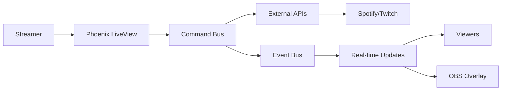

# Premiere Ecoute

Select, listen and note new album releases with your Twitch community

<div class="pt-12">
  <span @click="$slidev.nav.next" class="px-2 py-1 rounded cursor-pointer" hover="bg-white bg-opacity-10">
    Press Space for next page <carbon:arrow-right class="inline"/>
  </span>
</div>

---
layout: center
---

# What is Premiere Ecoute?

<div class="text-xl mt-8">

Premiere Ecoute turns **music discovery** into an **interactive experience** where streamers and their Twitch audiences can listen and note music together.

</div>

<div class="mt-12 grid grid-cols-2 gap-8">
<div>

### For Streamers
- Share your music taste live
- Engage your community
- Build shared experiences

</div>
<div>

### For Viewers
- Discover new music
- Vote on tracks in real-time
- Shape the community's taste

</div>
</div>

---
layout: default
---

# Application Objectives

<div class="mt-8">

## Primary Goal

Create an **interactive platform** that bridges music streaming (Spotify) with community engagement (Twitch) to transform passive listening into active participation.

<div class="mt-8"></div>

## Key Principles

<v-clicks>

- **Real-time Interaction**: Seamless synchronization between streamer and viewers
- **Community Building**: Foster shared musical experiences and collective taste-making
- **Accessibility**: Easy to use for both streamers and viewers
- **Data-Driven**: Track and aggregate community preferences over time

</v-clicks>

</div>

---
layout: two-cols
---

# Core Features

<div class="mt-4">

## Stream & Listen
- Play any album or playlist through **Spotify integration**
- Control playback from the web interface
- Spotify Premium required for streamers

## Vote & React
- Audience votes on tracks via **chat commands**
- **Interactive polls** during playback
- Multiple voting methods for flexibility

</div>

::right::

<div class="mt-4">

## Track & Rate
- Build a **community rating system** for every song
- Aggregate votes across sessions
- Historical data for trend analysis

## Overlays
- Beautiful **OBS overlays** for streams
- Real-time voting display
- Track information and session progress
- Customizable layouts

</div>

---
layout: default
---

# Technical Stack

<div class="grid grid-cols-2 gap-8 mt-12">

<div>

## Backend
- **Elixir/OTP**: Concurrent, fault-tolerant runtime
- **Phoenix Framework**: Web framework with real-time capabilities
- **Phoenix LiveView**: Real-time UI without JavaScript
- **PostgreSQL**: Robust data persistence

</div>

<div>

## Architecture Highlights
- **Event-Driven**: Command/Event Bus pattern
- **Domain-Driven Design**: Clear business domains
- **Real-Time PubSub**: WebSocket + Phoenix Channels
- **External APIs**: Spotify & Twitch integrations

</div>

</div>

<div class="mt-8">

## Key Technologies
`Ecto` · `Oban` · `Phoenix PubSub` · `OAuth2` · `REST APIs` · `WebSockets` · `ETS Caching`

</div>

---
layout: default
---

# System Architecture

<div class="mt-4">

## Core Components

<v-clicks>

1. **Sessions Management** - Orchestrates listening sessions from preparation to completion
2. **Command & Event Bus** - Central processing pipeline for all business operations
3. **External API Layer** - Dual-mode architecture for production & development
4. **Real-Time Layer** - Phoenix LiveView, WebSocket channels, and PubSub
5. **Caching Strategy** - Multi-layer ETS caching for high performance

</v-clicks>

<div class="mt-8"></div>

## Data Flow



</div>

---
layout: default
---

# Deployment

<div class="mt-8">

## Production Environment

<v-clicks>

- **Platform**: Fly.io cloud deployment
- **Region**: Multi-region support with automatic scaling
- **Database**: Managed PostgreSQL on Fly.io
- **Monitoring**: Comprehensive telemetry with Prometheus & Grafana

</v-clicks>

<div class="mt-8"></div>

## Deployment Process

```bash
# Commit changes
git commit -m "Update feature X"
git push origin main

# Deploy to production (requires permissions)
fly deploy

# Monitor deployment
fly logs -f
```

<div class="mt-6 text-sm opacity-75">
Note: Only project owner has deployment permissions. Contact maintainer for access.
</div>

</div>

---
layout: default
---

# Local Development

<div class="mt-4">

## Prerequisites
- **asdf** - Version manager for Erlang & Elixir
- **Docker Compose** - For PostgreSQL and observability stack
- **Spotify Developer Account** - For API credentials
- **Twitch Developer Account** - For chat integration

<div class="mt-8"></div>

## Quick Start

```bash
git clone https://github.com/mjanv/premiere-ecoute.git
cd premiere-ecoute
cp .env.example .env  # Configure API credentials

asdf install          # Install Erlang and Elixir
docker compose up -d  # Start database
mix setup             # Install deps & run migrations
mix                   # Start the server
```

Visit [localhost:4000](http://localhost:4000) to see the application.

</div>

---
layout: default
---

# Development Features

<div class="mt-8 grid grid-cols-2 gap-8">

<div>

## Mock API Layer
- Complete local development without external APIs
- Predictable test scenarios
- Spotify OAuth mocked
- Twitch chat simulation at `localhost:4001`

## Quality Tools
```bash
mix format      # Code formatting
mix credo       # Static analysis
mix dialyzer    # Type checking
mix test        # Unit tests
```

</div>

<div>

## Observability Stack
- **Grafana** dashboards at `localhost:3000`
- **Prometheus** metrics collection
- **PromEx** integration
- Custom telemetry handlers

## Development Workflow
- Phoenix LiveReload for instant feedback
- Comprehensive test coverage
- Database migrations with Ecto
- Structured logging

</div>

</div>

---
layout: center
class: text-center
---

# Roadmap

---
layout: default
---

# Product Roadmap

<div class="mt-8">

## Phase 1: Core Features (Current)
<v-clicks>

- ✅ Spotify integration for playback control
- ✅ Twitch chat integration for voting
- ✅ Real-time OBS overlays
- ✅ Basic session management
- ✅ Vote aggregation and scoring

</v-clicks>

<div class="mt-6"></div>

## Phase 2: Enhanced Engagement
<v-clicks>

- 🚧 Mobile application (React Native)
- 🚧 Advanced analytics and insights
- 🚧 Historical trend visualization
- 🚧 Playlist recommendations based on community votes
- 🚧 Multi-language support (i18n)

</v-clicks>

</div>

---
layout: default
---

# Technical Roadmap

<div class="mt-8">

## Infrastructure & Scalability
<v-clicks>

- Horizontal scaling for high-traffic events
- Advanced caching strategies
- Performance optimization
- Database query optimization
- Circuit breaker improvements

</v-clicks>

<div class="mt-6"></div>

## Features & Integrations
<v-clicks>

- Additional music platform support (Apple Music, YouTube Music)
- Discord bot integration
- Webhook APIs for third-party extensions
- Public API for developers
- Advanced overlay customization

</v-clicks>

</div>

---
layout: center
class: text-center
---

# Funding & Sustainability

---
layout: default
---

# Funding Model

<div class="mt-8">

## Current Status

**Open Source & Community-Driven**

The project is currently maintained as an open-source initiative, with development driven by community contributions and personal investment.

<div class="mt-8"></div>

## Future Considerations

<v-clicks>

- **Sponsorships**: GitHub Sponsors, Open Collective
- **Grants**: Open source software grants and music technology funds
- **Freemium Model**: Free tier with premium features for power users
- **API Access**: Paid tiers for commercial API usage
- **Partnerships**: Collaborations with music platforms and streaming communities

</v-clicks>

<div class="mt-8 text-center opacity-75">
The focus remains on building value for the community first.
</div>

</div>

---
layout: default
---

# Contributing

<div class="mt-8">

## How to Contribute

<div class="grid grid-cols-2 gap-8">

<div>

### Code Contributions
- Fork the repository
- Create a feature branch
- Follow coding standards
- Write tests
- Submit a pull request

### Documentation
- Improve existing docs
- Add examples and guides
- Translate to other languages

</div>

<div>

### Community
- Report bugs and issues
- Suggest new features
- Help other users
- Share your streams using Premiere Ecoute

### Resources
- **GitHub**: [mjanv/premiere-ecoute](https://github.com/mjanv/premiere-ecoute)
- **Docs**: In-repo documentation
- **Live Demo**: [premiere-ecoute.fly.dev](https://premiere-ecoute.fly.dev/)

</div>

</div>

</div>

---
layout: center
class: text-center
---

# Thank You!

<div class="mt-8">

## Get Started Today

Visit [premiere-ecoute.fly.dev](https://premiere-ecoute.fly.dev/)

<div class="mt-8">
  <a href="https://github.com/mjanv/premiere-ecoute" target="_blank" class="text-xl">
    GitHub Repository →
  </a>
</div>

<div class="mt-12 text-sm opacity-75">
Built with Elixir, Phoenix, and ❤️ for music communities
</div>

</div>

---
layout: end
---

# Questions?
